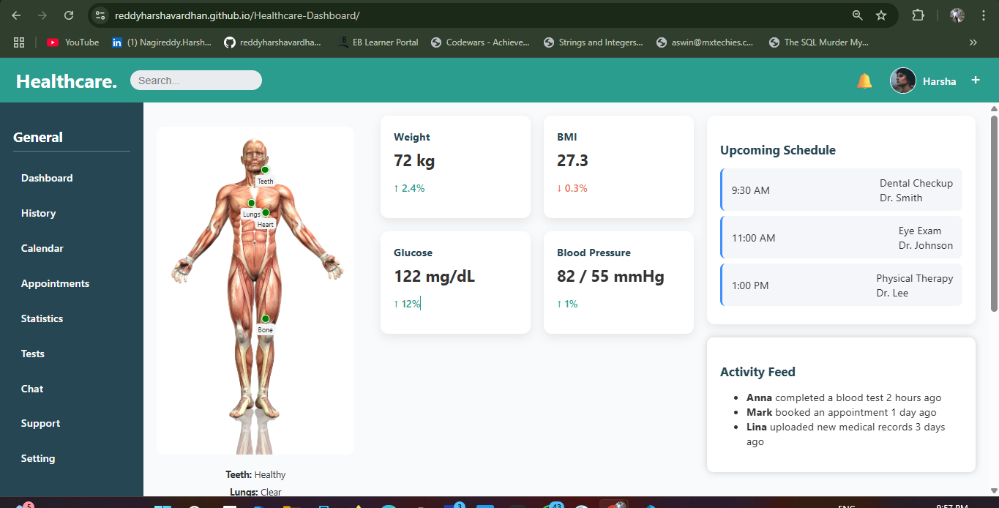

# 🏥 Healthcare Dashboard

A static, responsive Healthcare Dashboard built with **React.js**. This project visually represents a patient's anatomical health using a central body image with status indicators and mock data.

👉 [**Live Demo**](https://reddyharshavardhan.github.io/Healthcare-Dashboard/)


## 📸 Preview



## ✨ Features

- Responsive layout with sidebar and main dashboard
- Anatomical image (PNG) with health indicators (e.g., Heart, Lungs, Teeth, Liver)
- Mock data displayed using clean UI components
- Reusable component structure for scalability
- Styled with custom CSS and Tailwind utility classes

### Installation

```bash
git clone https://github.com/yourusername/healthcare-dashboard.git
cd healthcare-dashboard
npm install


